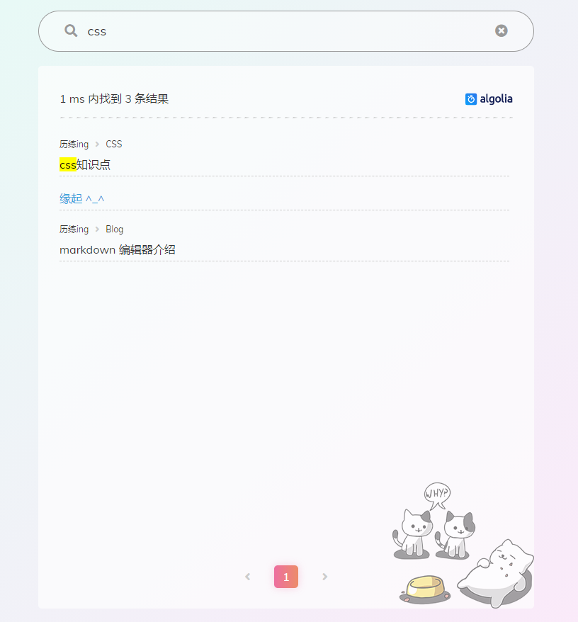
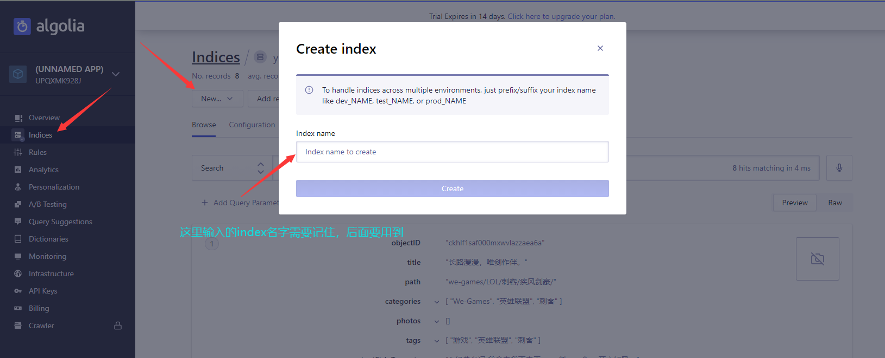

# 在博客中添加搜索功能

> 1. 添加效果
>
>    
>
> 2. 开始添加
>
>    下载最新的hexo主题，因为新的主题已经集成了algolia搜索，可以省去很多配置和修改。去官网注册，也可以绑定github账号登录。[去algolia官网](https://www.algolia.com)，注册好以后进去新建一个index。我们需要用到这个index的名字。
>
>    
>
> 3. 打开API Keys页面，里面的信息等会需要写到hexo的配置文件中
>
>    
>
> 4. 在根目录的站点配置文件_config.yml中加入如下配置，参照上图的各种key值
>
>    ```yaml
>    algolia:
>    appId: 'appid'
>    apiKey: 'apiKey'
>    adminApiKey: 'adminApiKey'
>    indexName: '上面填写的index名'
>    chunkSize: 5000
>    fields:
>    - title
>    - slug
>    - path
>    - content:strip
>    ```
>
>    我用的是shoka主题，这主题默认配置好了以下这些配置,所以`无需手动配置`。
>
>    ```yaml
>    algolia_search:
>      enable: true
>      hits:
>        per_page: 10
>      labels:
>        input_placeholder: Search for Posts
>        hits_empty: "我们没有找到任何搜索结果: ${query}"
>        hits_stats: "找到${hits}条结果（用时${time} ms）"
>    ```
>
> 5. `重点：`在git bash中执行`hexo algolia`把配置提交到algolia上。`这一步是每次写完都要提交的`
>
>    ```yaml
>    hexo algolia
>    ```

# 在文章中添加相册

在插入的图片最后一张末尾加上`{.gallery}`或`{.gallery data-height="120"}`，记得换行，不要跟在图片后面。

```yaml
{.gallery}
#  这是排列起来
{.gallery data-height="120"}
# 这是自定义高排列
```

# 添加评论功能

> 1. 进入Valine官网，注册登录， 安照快速开始步骤进行。[Valine官网](https://valine.js.org/)
>
> 2. 在评论的时候填入对应MD5值，在评论区头像上右击自己的头像，后面有一段字符串例如：`https://gravatar.loli.net/avatar/131ab989394372ace9fd15f9fc257a75?size=80&d=mp`
>
>    中有，avatar后面的字符串。记得在前面加上`-`。

# 在博客中添加宠物

> ​	在自己的博客中安装2D宠物，
>
> 1. 安装插件
>
>    ```js
>    npm install --save hexo-helper-live2d
>    ```
>
> 2. 选择自己喜欢的宠物，我在这里列出一部分宠物代码。
>
>    ```js
>    live2d-widget-model-chitose
>    live2d-widget-model-epsilon2_1
>    live2d-widget-model-gf
>    live2d-widget-model-haru/01 (use npm install --save live2d-widget-model-haru)
>    live2d-widget-model-haru/02 (use npm install --save live2d-widget-model-haru)
>    live2d-widget-model-haruto
>    live2d-widget-model-hibiki
>    live2d-widget-model-hijiki
>    live2d-widget-model-izumi
>    live2d-widget-model-koharu
>    live2d-widget-model-miku
>    live2d-widget-model-ni-j
>    live2d-widget-model-nico
>    live2d-widget-model-nietzsche
>    live2d-widget-model-nipsilon
>    live2d-widget-model-nito
>    live2d-widget-model-shizuku
>    live2d-widget-model-tororo
>    live2d-widget-model-tsumiki
>    live2d-widget-model-unitychan
>    live2d-widget-model-wanko
>    live2d-widget-model-z16
>    ```
>
> 3. 具体的安装：`npm install + 宠物代码` 例：
>
>    ```
>    npm isntall live2d-widget-model-tororo
>    ```
>
> 4. 在站点配置文件中`_config.yml`添加配置
>
>    ```html
>    live2d:
>      enable: true
>      scriptFrom: local
>      pluginRootPath: live2dw/
>      pluginJsPath: lib/
>      pluginModelPath: assets/
>      model:
>        # 这是白猫的模型
>        use: live2d-widget-model-tororo
>      display:
>        # 设置模型的位置
>        position: right
>        width: 120 # 宽度
>        height: 240 # 高度
>      mobile:
>        show: false
>      react:
>        opacityDefault: 1
>        opacityOnHover: 1
>    ```
>
> 5. 这里需要注意的是，每一个宠物模型都需要`npm install + 宠物模型代码`来安装才能使用，且安装以后需要在配置文件中配置`use`的模型值，值为你安装的宠物模型代码。最后运行部署就可以了。

# hexo博客文章加密

> 1. 前言
>
>    有时候我们可能需要一些私密的博客空间，这部分的文章类容不想让别人看见，在hexo中，此时我们可以通过一个插件来实现这种功能。`hexo-blog-encrypt`
>
> 2. 安装
>
>    ```js
>    npm install --save hexo-blog-encrypt
>    ```
>
> 3. 快速使用
>
>    将password添加到您的文章头部信息中，如下这样：
>
>    ```html
>    title: Hello World
>    date: 2021-03-16 17:12:21
>    password: mima # 这是你自己输入的密码
>    ---
>    ```
>
> 4. 修改文章信息头
>
>    - 最简约简单的写法就是如上面第三点的那样，只要在文章的信息头加上`password：`后面跟你自己设置的密码就可以了。当然，写这样的前提是你的配置文件里面都配置好了各种项。如果简约的不行，就按照正常的写法来写吧！
>
>    - 正常的写法是这样的：
>
>      ```html
>      title: Hello World
>      tags:
>      - 加密文章tag
>      date: 2020-03-13 21:12:21
>      password: muyiio
>      abstract: 这里有东西被加密了，需要输入密码查看哦。
>      message: 您好，这里需要密码。
>      wrong_pass_message: 抱歉，这个密码看着不太对，请再试试。
>      wrong_hash_message: 抱歉，这个文章不能被纠正，不过您还是能看看解密后的内容。
>      ---
>      ```
>
> 5. 修改博客根目录`_config`添加配置文件
>
>    ```html
>    # 设置博客文章密码
>    encrypt: # hexo-blog-encrypt
>      enable: true
>      abstract: 这里有东西被加密了，需要输入密码查看哦。
>      message: 请输入密码查看，密码为6位数哦~。
>      tags:
>      - {name: tagName, password: mima}
>      template: <div id="hexo-blog-encrypt" data-wpm="{{hbeWrongPassMessage}}" data-whm="{{hbeWrongHashMessage}}"><div class="hbe-input-container"><input type="password" id="hbePass" placeholder="{{hbeMessage}}" /><label>{{hbeMessage}}</label><div class="bottom-line"></div></div><script id="hbeData" type="hbeData" data-hmacdigest="{{hbeHmacDigest}}">{{hbeEncryptedData}}</script></div>
>      wrong_pass_message: 抱歉, 这个密码看着不太对, 请再试试。
>      wrong_hash_message: 抱歉, 这个文章不能被校验, 不过您还是能看看解密后的内容。
>    ```
>
>    

