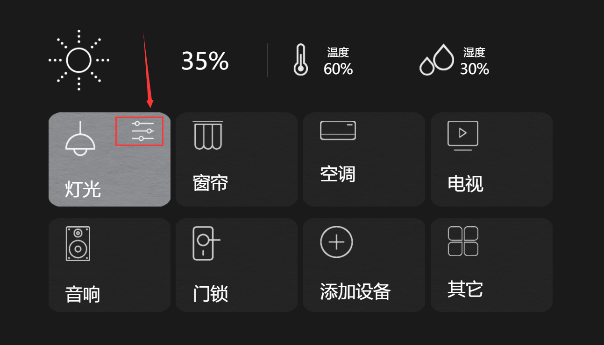

# 绑定事件，根据下标判断当前的元素

用一个`li`渲染八个list小div，当鼠标放上去的时候，给他们绑定两个事件，一个移入事件，一个移除事件。首先，用css的`hover`属性给每一个div添加一个背景图片，鼠标放上去的时候背景为灰色。移开就恢复黑色。

1. 效果图如下：

   

2. 代码如下：

   ```html
   <template>
     <section>
       <div class="card">
         <ul>
           <li v-for="(item,index) of list" @mouseover="yiru(index)" @mouseleave="yichu(index)" :key="item.id" class="list">
             
             <span>{{ item.text }}</span>
             <div v-if="item.isactive" class="setup"></div>
           </li>
         </ul>
       </div>
     </section>
   </template>
   ```

   ```javascript
   <script>
     export default{
       data() {
         return{
           list:[
             {id:'1', imgsrc: require('../../assets/smarthome_index/线性吊灯图标.png'), text: '灯光', isactive: false },
             {id:'2', imgsrc: require('../../assets/smarthome_index/窗帘图标.png'), text: '窗帘', isactive: false },
             {id:'3', imgsrc: require('../../assets/smarthome_index/空调图标.png'), text: '空调', isactive: false },
             {id:'4', imgsrc: require('../../assets/smarthome_index/电视机图标.png'), text: '电视', isactive: false },
             {id:'5', imgsrc: require('../../assets/smarthome_index/音响图标.png'), text: '音响', isactive: false },
             {id:'6', imgsrc: require('../../assets/smarthome_index/门锁图标.png'), text: '门锁', isactive: false },
             {id:'7', imgsrc: require('../../assets/smarthome_index/添加设备图标.png'), text: '添加设备', isactive: false },
             {id:'8', imgsrc: require('../../assets/smarthome_index/其它图标.png'), text: '其它', isactive: false }
           ]
         }
       },
       methods:{
         yichu(index){
           this.list[index].isactive = false
         },
         yiru(index){
           this.list[index].isactive = true
           console.log(index);
         }
       }
     }
   </script>
   ```

   ```css
   <style scoped>
     .card{
       width: 1200px;
       /* border: 1px solid red; */
       margin: auto;
       overflow: hidden;
       display: flex;
       align-items: center;
       position: relative;
       margin-bottom: 200px;
     }
     .list{
       box-sizing: border-box;
       color: #FFFFFF;
       list-style: none;
       width: 290px;
       height: 224px;
       float: left;
       margin-right: 13.33333px;
       background-image: url(../../assets/smarthome_index/没选中背景块.png);
       padding-top: 20px;
       padding-left: 40px;
       font-size: 42px;
       position: relative;
     }
     .list img{
       display: block;
       margin-bottom: 49px;
     }
     .setup{
       position: absolute;
       top: 20px;
       right: 40px;
     }
     .list:hover{
       background-image: url(../../assets/smarthome_index/选中背景块.png);
     }
     .list:nth-child(4){
       margin-right: 0px;
       margin-bottom: 27px;
     }
     .list:nth-child(8){
       margin-right: 0px;
     }
   </style>
   ```

   鼠标放上去的时候，显示当前div右上角的设置标志。移开则恢复没有选中状态。

# 组件间的传值

> 1. `父传子`
>
>    - 在子组件中创建一个`props`，里面自定义一个名字，冒号后面跟的是从父组件传过来的type类型。共有 `String` 字符串    `Number` 数字    `Boolean` 布尔    `Array` 数组     `Object` 对象    `Date` 日期    `Function` 函数    `Symbol` 独一无二的值(es6语法)，首字母大写。
>
>      ```js
>      <script>
>        export default{
>          props:{
>            imgsrc: String
>          }
>        }
>      </script>
>      ```
>
>    - 在父组件中，在需要传值的组件上绑定需要的值。`:imgsrc`是子组件需要接收的名字，后面的`imgsrc`是data中定义的数据的名字，就是把data中的值传递给子组件。
>
>      ```html
>      <sm-kongzhi :imgsrc="imgsrc"></sm-kongzhi>
>      ```
>
>      ```javascript
>      <script>
>      import SmNav from "../../components/smarthome_index/smarthome_nav"
>      import SmKongzhi from "../../components/smarthome_index/smarthome_kongzhi"
>      import SmCard from "../../components/smarthome_index/smarthome_card"
>      export default {
>        data() {
>          return{
>            imgsrc: require('../../assets/smarthome_icon/灯光.png')
>            /* 主要就是把这个值,传给子组件 */
>          }
>        },
>        components: { /* 组件的注册 */
>          SmNav,
>          SmKongzhi,
>          SmCard,
>        },
>        methods:{
>          switchimg(i){
>            this.imgsrc = i
>          }
>        }
>      }
>      </script>
>      ```
>
>    总结一下：
>
>    1. 子组件在`props`中创建一个属性，用以接收父组件传过来的值
>    2. 父组件中注册子组件
>    3. 在子组件标签中添加子组件props中创建的属性
>    4. 把`data`中需要传给子组件的值赋给该属性
>
> 2. `子传父`
>
>    - 在子组件中创建一个点击事件，在响应该点击事件的函数中使用`$emit`来触发一个自定义事件，并传递一个参数。
>
>      ```javascript
>      card(index){
>        this.items.forEach((list,i)=>{
>          if(index==i){
>            this.$emit("dianji",list.imgsrc)
>          }
>        })
>      }
>      ```
>
>      例如上面代码：`$emit("dianji",list.imgsrc)`$emit（）中，第一个参数自定义事件的名字，第二个参数是你需要传到父组件的值。这个值可以是字符串，数据类型，数组类型等。
>
>    - 在父组件中，`是以一个事件的形势接收`因为传过来的是一个自定义事件。
>
>      ```html
>      <sm-card @dianji="switchimg"></sm-card>
>      ```
>
>      例如上面代码，`dianji`是子组件传过来的。你可以自定义一个方法名在父组件中使用该方法名。这时，你自定义的方法里面就可以控制父组件里面的数据，也可以操作父组件的`data`数据再传弟给其他子组件。
>
> 3. `相邻组件间的传值`
>
>    目前我使用的是，先把他们都传给父组件，再又父组件又传给其他子组件。所有就转换成了，子传父、父传子的问题了。
>
>    其他方法等待更新。。。

# vue中引用bootstarpVue

> 1. 进入你的项目里
>
> 2. 打开命令行工具，安装BootstrapVue,
>
> 3. ```javascript
>    npm i bootstrap-vue -S
>    ```
>
> 4. 安装后，打开main.js主程序入口文件
>
> 5. ```js
>    import BootstrapVue from 'bootstrap-vue'
>    
>    import 'bootstrap/dist/css/bootstrap.css'
>    import 'bootstrap-vue/dist/bootstrap-vue.css'
>    
>    // 注册为全局组件
>    Vue.use(BootstrapVue)
>    
>    ```
>
> 6. 完成，可以直接使用它的组件了

# vue自动生成二维码

> 1. 安装
>
>    ```js
>    npm install vue-qr --save
>    ```
>
> 2. 导入vue项目中使用
>
>    ```js
>    <template>
>      <vue-qr :text="downloadData.url" :margin="0" colorDark="#f67b29" colorLight="#fff" :logoSrc="downloadData.icon + '?cache'" :logoScale="0.3" :size="200"></vue-qr>
>    </template>
>     
>    <script>
>    import vueQr from 'vue-qr'
>    export default {
>        components: {
>            vueQr
>        },
>        data() {
>            return {
>                downloadData: {
>                    url: '扫码访问的链接地址',
>                    icon: '随便一张图片的地址也行'
>                }
>            }
>        }
>    }
>    </script>
>    ```
>
>    注：上方代码中的 logoSrc 对应的图片url地址 我加上了 ?cache 是为了解决资源请求的跨域问题。具体情况展现可自行研究。
>
>    
>
> 3. | 属性       | 介绍                                                 |
>    | ---------- | ---------------------------------------------------- |
>    | size       | 二维码宽高大小，因为是正方形，所以设一个参数即可     |
>    | margin     | 默认边距20px，不喜欢的话自己设为0                    |
>    | colorDark  | 实点的颜色，注意要和colorLight一起设置才有效         |
>    | colorLight | 空白的颜色，注意要和colorDark一起设置才有效          |
>    | bgSrc      | 嵌入背景图地址，没什么卵用，不建议设置               |
>    | logoSrc    | 二维码中间的图，这个是好东西，设置一下显得专业点     |
>    | logoScale  | 中间图的尺寸，不要设太大，太大会导致扫码失败的       |
>    | dotScale   | 那些小点点的大小，这个也没什么好纠结的，不建议设置了 |
>
>    总结：主要是运用组件自动生成，二维码里面的类容就是text中的类容。


