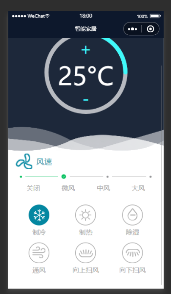
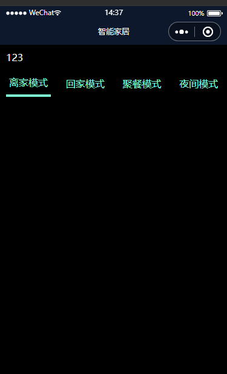

# 使用三元表达式给data赋值

> 效果要求：
>
> 1. 点击切换不同的图片。图片是数据里面渲染出来的。效果如图：
>
>    
>
> 2. view代码
>
>    ```
>      <view class="model">
>        <view class="item" wx:for="{{model}}" wx:key="id" bind:tap="model" data-list="{{index}}">
>        <image class="model_img" src="{{item.active ? item.src : item.url}}"/>
>          <text class="model_title">{{item.title}}</text>
>        </view>
>      </view>
>    ```
>
> 3. js代码
>
>    ```javascript
>    Page({
>      data: {
>        value: 25,
>        select: true,
>        selects: false,
>        gradientColor: {
>          '0%': '#ffd01e',
>          '100%': '#ee0a24',
>        },
>        active: 1,
>        steps: [{desc: '',},{desc: '',},{desc: '',},{desc: '',}], //使用vant框架里面的插件
>        model:[
>          {"id":"1",
>          title:"制冷",
>          active:true,
>          "url":"https://img10.360buyimg.com/ddimg/jfs/t1/134516/26/19333/3270/5fd33f78E9c136a59/0b19ff0493f32e4c.png",
>          "src":"https://img12.360buyimg.com/ddimg/jfs/t1/150035/29/17912/3382/5fd32c66Ee98ecb19/46608164068c29f3.png"
>        },{"id":"2",
>          title:"制热",
>          active:false,
>          "url":"https://img13.360buyimg.com/ddimg/jfs/t1/145313/32/18095/3151/5fd33f78E3f2d49c0/1b86c110299cbdc1.png",
>          "src":"https://img14.360buyimg.com/ddimg/jfs/t1/134767/24/19690/3071/5fd32c66Ea9940e9b/b89e37d1c4db6830.png"
>        },
>        {"id":"3",
>          title:"除湿",
>          active:false,
>          "url":"https://img12.360buyimg.com/ddimg/jfs/t1/133916/15/19322/3365/5fd33f78E5fb0d7b5/6ad3f85545bfbe39.png",
>          "src":"https://img13.360buyimg.com/ddimg/jfs/t1/147302/27/17867/3015/5fd32c66E5176019b/30cad177a93d549d.png"
>        },{"id":"4",
>          title:"通风",
>          active:false,
>          "url":"https://img13.360buyimg.com/ddimg/jfs/t1/153818/16/9478/3087/5fd33f78Ecc084dde/ecf2935da0de6e31.png",
>          "src":"https://img11.360buyimg.com/ddimg/jfs/t1/146277/39/17976/2868/5fd32c66Ebd73527e/d946e66f1984ccd9.png"
>        },{"id":"5",
>          title:"向上扫风",
>          active:false,
>          "url":"https://img10.360buyimg.com/ddimg/jfs/t1/145786/17/17977/3971/5fd33f78E59684630/cf26aa59b216555b.png",
>          "src":"https://img10.360buyimg.com/ddimg/jfs/t1/132750/9/19225/3036/5fd32c66Ec7df8a55/0b6dd2dcdfa57cdd.png"
>        },{"id":"6",
>          title:"向下扫风",
>          active:false,
>          "url":"https://img13.360buyimg.com/ddimg/jfs/t1/133678/20/19346/3961/5fd33f78Edf3cb491/d6f2c03e310629be.png",
>          "src":"https://img11.360buyimg.com/ddimg/jfs/t1/137747/37/18156/3152/5fd32c66E5213f371/04484666357f9863.png"
>        }],
>      },
>      level:function(e){
>        var index = e.currentTarget.dataset.list
>        this.setData({
>          active: index
>        })
>      },
>      jia:function(){
>        const value = this.data.value;
>        this.setData({
>          value: parseInt(value) + 10
>        })
>      },
>      jian:function(){
>        const value = this.data.value;
>        this.setData({
>          value: parseInt(value) - 10
>        })
>      },
>      model:function(e){
>        console.log(e)
>        const list = e.currentTarget.dataset.list
>        this.data.model.forEach((item,index) => {
>          if(list==index){
>            var i = 'model['+index+'].active'
>            this.setData({
>              [i]:!(this.data.model[index].active)
>            })
>          }
>        });
>        
>      },
>    
>    });
>    ```
>
>    
>
> 4. 实现原理：
>
>    - 在需要渲染的view里面先`wx:for`循环，给每一个view绑定一个点击事件。在自定义一个属性`data-list="{{index}}"`这个自定义值不是数组的下标。在数组中添加一个属性名为active的属性。值为布尔类型。true和false都可以。看自己的选择，在图片的src属性上使用三元表达式：`src="{{item.active?item****.****src** **:** **item****.****url**}}"`这里不要漏掉`=`和`""`双引号。判断数组里面的active的值，如果为true，则图片路径为第一个，反之则为第二个。数组里面保存的是两个图片的路径，页面只保留一个图片的路径用做计算三元表达式的值即可。
>
>    - 在js中，声明一个变量来接受刚才在view里面自定义的属性。`const list = e.currentTarget.dataset.list`，使用forEach循环数组。用循环出来的index和自己定义属性值对比，如果相等，证明点击的就是当前数组中的`[index]`某一项。这时候在声明一个变量`i`来接受当前数组中每一项的（这里用index代表每一项）active属性值。这时候。i 取反，再赋值给数组里面的active（就是刚才声明的i）。
>
>      ```javascript
>      this.setData({
>      	[i]:!(this.data.model[index].active)
>      })
>      ```
>
>      

# 小程序中的父传子

> 父组件（页面）向子组件传递数据，是通过标签属性的方式来传递的。
>
> 以下代码表示，向子组件`iuiu`中传递数据，在父组件的WXML中，list是标签名，传递当前wxml的js文件中的`list`数组，
>
> ```wxjs
> <iuiu list="{{list}}"></iuiu>
> ```
>
> 在子组件的js文件中，在`properties`中接收父组件传递过来的数据
>
> ```js
> properties: {
>     list:{
>       type:Array,
>       value:[]
>     }
>   },
> ```
>
> `list`是父组件中传递过来的标签名。type，类型：Arrye、String、Number、Boolean、Object、null（表示任意类型）
>
> `value`可以给定初始值，可以默认为空。

# 小程序中的子传父

>
>
>子组件向父组件传递数据，是通过事件的方式传递的。在子组件中绑定的方法中声明一个变量，把需要传递的值赋值给这个变量，在通过`this.triggerEvent`这个事件传递给父组件.
>
>```js
>methods:{
>    hangent(e){
>      const index = e.currentTarget.dataset.index
>      this.triggerEvent("itemChange",index)
>    }
>  }
>```
>
>触发父组件中的自定义事件，同时传递数据给父组件。
>
>`this.triggerEvent("父组件自定义的名称","要传递的参数")`
>
>例如：上面的子组件传递的方法名为`itemChange`，那么父组件中因该这么写:
>
>```wxjs
><iuiu list="{{list}}" binditemChange="dianji"></iuiu>
>```
>
>`bind+方法名=父组件中需要定义的函数名称。`
>
>```javascript
>dianji(e){
>    const index = e.detail
>    console.log(index)
>    let list = this.data.list
>    list.forEach((item,i) => index===i?item.active=true:item.active=false);
>    this.setData({
>      list
>    })
>  }
>```
>
>这里需要**注意**的是，传过来的值**不是在**`e.currentTarget.dataset`之中，**而是在**`e.detail`中。

# 组件中的插槽使用

>`slot`
>
>slot标签，其实就是一个占位符，插槽。等到父组件调用子组件的时候，再传递标签过来，最终，这些被传递过来的标签就会替换slot插槽的位置。
>
>效果图如下：
>
>
>
>点击不同的导航，切换到不同的插槽。
>
>`子组件wxml代码：`
>
>```
><view class="content">
><slot></slot>
></view>
>
><view class="box">
><block wx:for="{{list}}" wx:key="id">
><view bindtap="hangent" data-index="{{index}}" class="item {{item.active?'isactive':''}}">{{item.name}}</view>
></block>
></view>
>```
>
>`子组件js代码`
>
>```js
>Component({
>properties: {
>list:{
> type:Array,
> value:[]
>}
>},
>data: {
>
>},
>methods:{
>hangent(e){
> const index = e.currentTarget.dataset.index
> console.log(index)
> this.triggerEvent("itemChange",index)
>}
>}
>})
>
>```
>
>`父组件中wxml代码`
>
>```
><iuiu class="ii" list="{{list}}" binditemChange="dianji">
><block wx:if="{{list[0].active}}">123</block>
><block wx:elif="{{list[1].active}}">456</block>
><block wx:elif="{{list[2].active}}">789</block>
><block wx:else>否则显示</block>
></iuiu>
>```
>
>`父组件中js代码`
>
>```js
>Page({
>data: {
>list:[
> {"id":1,"name":"离家模式","active":true},
> {"id":2,"name":"回家模式","active":false},
> {"id":3,"name":"聚餐模式","active":false},
> {"id":4,"name":"夜间模式","active":false}
>]
>},
>dianji(e){
>const index = e.detail
>console.log(index)
>let list = this.data.list
>list.forEach((item,i) => index===i?item.active=true:item.active=false);
>this.setData({
> list
>})
>}
>})
>```
>
>**以上的插槽是配合组件间的传值使用的。**

# 在小程序中截取字符串

> ```js
> App.$get('/warn/page', {}, res => {
>       console.log(res);
>       res.rows.forEach((item) => {
>         item.ctime = item.ctime.substring(0, 10); //截取时间格式为 xxxx-xx-xx
>       })
>       this.setData({
>         AlarmType:res.rows
>       })
>       console.log(this.data.AlarmType);
>     })
> ```
>
> 直接在需要截取的变量后面点`substring（）`小括号里面放需要截取的开始位置和结束位置下标从0开始。。